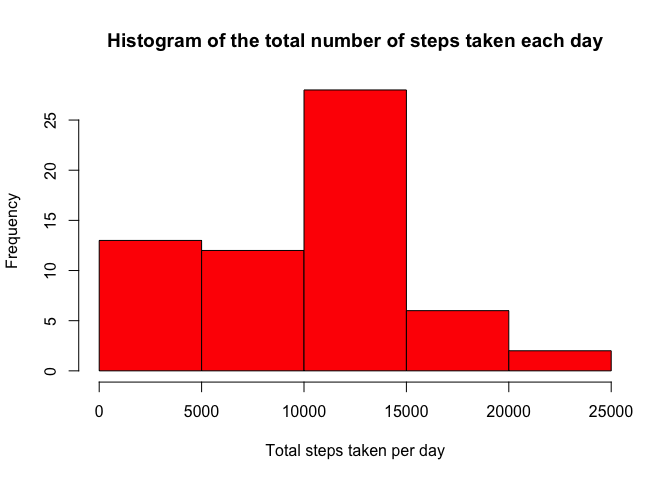
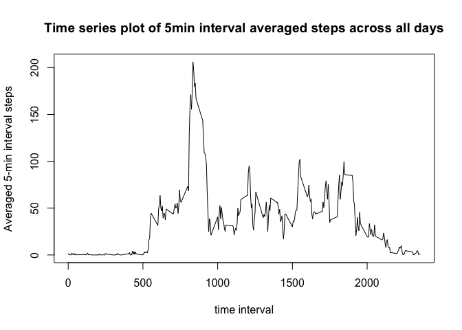
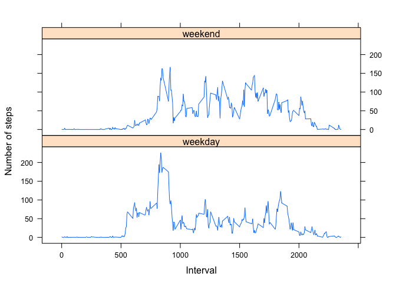

# Loading and preprocessing the data

```r
data<- read.csv("activity.csv", sep=",", header=TRUE)
data$date<- as.Date(data$date, "%Y-%m-%d")
```

# What is mean total number of steps taken per day?
* Calculate the total number of steps taken per day

```r
steps_day<-tapply(data$steps, data$date, sum, na.rm=TRUE)
```

* Make a histogram of the total number of steps taken each day

```r
hist(steps_day, col="red", xlab="Total steps taken per day", ylab="Frequency", main="Histogram of the total number of steps taken each day")
```

 

* Calculate and report the mean and median of the total number of steps taken per day

```r
m<-as.integer(mean(steps_day))
me<-as.integer(median(steps_day))
```
The mean is 9354 and median is 10395.

# What is the average daily activity pattern?
* Plot the 5-min invertal average number of steps taken

```r
steps_5min<-tapply(data$steps, data$interval, mean, na.rm=TRUE)
plot(names(steps_5min), steps_5min, type="l", xlab="time interval", ylab="Averaged 5-min interval steps", main="Time series plot of 5min interval averaged steps across all days")
```

 

* Which 5-minute interval, on average across all the days in the dataset, contains the maximum number of steps?

```r
m5<-max(steps_5min)
names(steps_5min[steps_5min==m5])
```
The 835th interval has the maximum steps.

# Imputting missing values
* Calculate and report the total number of missing values in the dataset

```r
nrow(subset(data, is.na(data$steps)))
```
There are 2304 rows missing values.

* Devise a strategy for filling in all of the missing values in the dataset.  
_Choose to use the mean of the 5min interval (acorss all days) to fill in all missing values in the dataset._

```r
## Pull out the subset data with NA steps
data_fill<-subset(data, is.na(data$steps))
data_fill$steps<-sapply(data_fill$interval, function(x) as.integer(steps_5min[[as.character(x)]]))
```

* Create a new dataset that is equal to the original dataset but with the missing data filled in.

```r
data_new<-rbind(data_fill, subset(data, !is.na(data$steps)))
```

* Make a histogram of the total number of steps taken each day and Calculate and report the mean and median total number of steps taken per day. Do these values differ from the estimates from the first part of the assignment? What is the impact of imputing missing data on the estimates of the total daily number of steps?

```r
steps_day_new<-tapply(data_new$steps, data_new$date, sum)
hist(steps_day_new, col="blue", xlab="Total steps taken per day", ylab="Frequency", main="After inputting missing values")
```

 

```r
m_new<- as.integer(mean(steps_day_new))
me_new<- as.integer(median(steps_day_new))
```
After imputting the missing values, the mean and median total number of steps taken per day are 10749 and 10641 correspondingly, which are both greater than the results in the first part.  
So, the impact is that the inputted data increased the total daily number of steps.

# Are there differences in activity patterns between weekdays and weekends?
* Create a new factor variable in the dataset with two levels – “weekday” and “weekend” indicating whether a given date is a weekday or weekend day.

```r
temp<- factor(c("weekday","weekday","weekday","weekday","weekday","weekend","weekend"))
names(temp)<-c("Mon","Tue","Wed","Tur","Fri","Sat","Sun")
weekday_info<-temp[weekdays(data_new$date, abbreviate = TRUE)]
data_new<-cbind(data_new, weekday_info)
```
* Make a panel plot containing a time series plot (i.e. 𝚝𝚢𝚙𝚎 = "𝚕") of the 5-minute interval (x-axis) and the average number of steps taken, averaged across all weekday days or weekend days (y-axis).  


```r
steps_5min<-tapply(data_new$steps, list(data_new$interval, data_new$weekday_info), mean)
Interval<- as.integer(rownames(steps_5min))
Interval<- c(Interval, Interval)
weekday_info<-factor(c(rep("weekday",nrow(steps_5min)), rep("weekend",nrow(steps_5min))))
data_5min<- data.frame(m_steps=c(steps_5min[,1], steps_5min[,2]), weekday_info, Interval)
library(lattice)
xyplot(m_steps ~ Interval|weekday_info, data=data_5min, type="l", layout=c(1,2), xlab="Interval", ylab="Number of steps")
```

 
